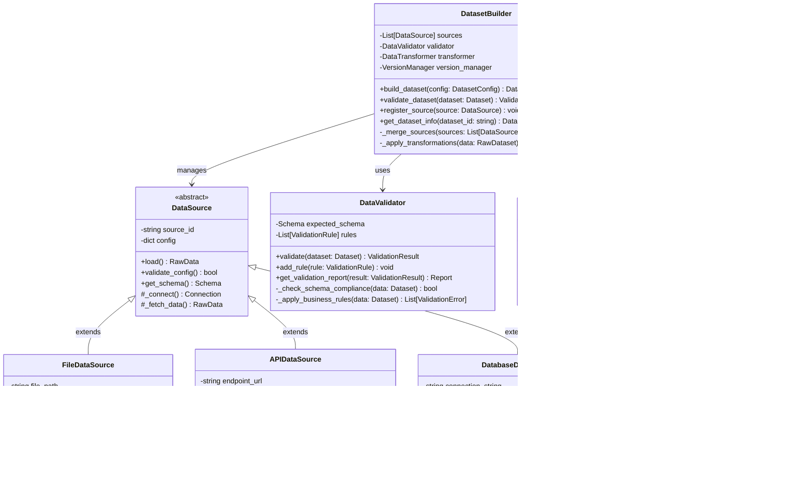

# 🧠 Agent Evaluation Platform – C4 Architecture

This document describes the architecture of the **Agent Evaluation Platform** using the [C4 model](https://c4model.com/). It provides a progressive view of the system, from high-level context (C1) down to class-level design (C4).

---

## 🗺️ C1 – System Context Diagram

The System Context diagram provides the highest-level view of the **Agent Evaluation Platform**, showing how it fits within the broader organizational ecosystem. This diagram answers the fundamental questions: *Who uses the system?* and *What other systems does it interact with?*

### 🎯 System Purpose

The **Agent Evaluation Platform** is a comprehensive solution for testing, validating, and monitoring AI agents throughout their development lifecycle. It provides automated evaluation pipelines, performance tracking, and detailed reporting to ensure AI agents meet quality standards before deployment.

### 👥 Primary Actors

**🔬 QA Tester**
- **Role**: Quality assurance professionals responsible for validating agent behavior
- **Key Activities**: 
  - Create comprehensive test datasets covering edge cases and scenarios
  - Define evaluation criteria and acceptance thresholds
  - Review test results and identify regression issues
  - Maintain test data quality and coverage metrics

**🛠️ ML Engineer** 
- **Role**: Machine learning practitioners developing and optimizing AI agents
- **Key Activities**:
  - Configure agent parameters, prompts, and model settings
  - Set up evaluation pipelines and experiment tracking
  - Analyze performance metrics and optimization opportunities
  - Implement agent improvements based on evaluation feedback

**📊 Analyst / Product Manager**
- **Role**: Business stakeholders tracking project progress and agent performance
- **Key Activities**:
  - Review high-level performance reports and trend analysis
  - Monitor compliance with business requirements and SLAs
  - Make go/no-go decisions for agent deployments
  - Communicate results to executive leadership and clients

### 🌐 External System Integrations

**📈 MLflow 3.4.0 (Tracking + Registry)**
- **Purpose**: Experiment tracking, model registry, and artifact storage
- **Integration Points**:
  - Stores evaluation metrics, model versions, and experiment metadata
  - Maintains lineage between agent configurations and performance results
  - Provides model versioning and deployment staging capabilities
  - Hosts evaluation artifacts (datasets, logs, model outputs)

**🔗 GitHub / Version Control System**
- **Purpose**: Source code management and configuration versioning
- **Integration Points**:
  - Pulls latest agent configurations, prompts, and evaluation scripts
  - Tracks changes to evaluation criteria and test specifications
  - Manages issue tracking for evaluation failures and improvements
  - Provides audit trail for all system modifications

**🔄 CI/CD Runner (Jenkins/GitHub Actions)**
- **Purpose**: Automated pipeline execution and continuous evaluation
- **Integration Points**:
  - Triggers evaluation runs on code commits or scheduled intervals
  - Executes regression testing suites automatically
  - Provides build status and pipeline health monitoring
  - Enables automated deployment gates based on evaluation results

**🤖 LLM Providers (OpenAI / Hugging Face)**
- **Purpose**: Large language model inference and API services
- **Integration Points**:
  - Executes agent inference calls during evaluation scenarios
  - Provides access to various model types and configurations
  - Handles rate limiting, authentication, and error management
  - Supports both cloud-based and self-hosted model endpoints

**📢 Notification Systems (Slack / Email)**
- **Purpose**: Real-time alerting and communication channels
- **Integration Points**:
  - Sends evaluation completion notifications and summary reports
  - Alerts on evaluation failures, performance degradation, or SLA breaches
  - Provides digest reports for scheduled evaluation runs
  - Enables team collaboration around evaluation results

### 🔄 Key Data Flows

1. **Evaluation Request Flow**: CI/CD → Platform → MLflow (results storage)
2. **Configuration Management**: GitHub → Platform → LLM Providers (execution)
3. **Monitoring & Alerting**: Platform → Notification Systems → Stakeholders
4. **Analysis & Reporting**: MLflow → Platform → Stakeholders (dashboards)


### 🎯 Business Context

This platform addresses critical challenges in AI agent development:
- **Quality Assurance**: Systematic testing prevents deployment of unreliable agents
- **Continuous Monitoring**: Ongoing evaluation catches performance regressions early
- **Compliance & Auditing**: Detailed logging supports regulatory requirements
- **Team Collaboration**: Centralized reporting enables cross-functional decision making
- **Risk Mitigation**: Automated gates prevent problematic agents from reaching production

---

## 🏗️ C2 – Container Diagram

The Container diagram breaks down the **Agent Evaluation Platform** into its major deployable units and shows how they communicate. This level focuses on the high-level technology choices and deployment architecture, answering: *What are the major building blocks?* and *How do they interact?*

### 🎯 Container Overview

The platform follows a **microservices architecture** with clear separation of concerns, enabling independent scaling, deployment, and maintenance of each component. The design prioritizes reliability, observability, and horizontal scalability to handle varying evaluation workloads.

### 🖥️ Client Layer

**🌐 Web UI / Dashboard**
- **Technology**: React.js with TypeScript, Material-UI components
- **Purpose**: Primary interface for users to interact with the evaluation platform
- **Key Capabilities**:
  - **Interactive Dashboards**: Real-time metrics visualization and trend analysis
  - **Test Management**: Create, edit, and organize evaluation datasets and scenarios
  - **Report Viewer**: Browse evaluation results with filtering and drill-down capabilities
  - **Configuration Interface**: Manage agent settings, prompts, and evaluation parameters
  - **User Management**: Role-based access control and team collaboration features
- **Deployment**: Static assets served via CDN with client-side routing
- **Authentication**: OAuth 2.0 integration with enterprise SSO systems

### ⚙️ Backend Services

**🚀 Evaluation API (FastAPI)**
- **Technology**: Python FastAPI with Pydantic models, async/await architecture
- **Purpose**: Central orchestration layer that coordinates all evaluation activities
- **Key Responsibilities**:
  - **Request Handling**: RESTful API endpoints for evaluation triggers and status queries
  - **Authentication & Authorization**: JWT token validation and permission enforcement
  - **Validation**: Input sanitization and schema validation for all requests
  - **Orchestration**: Coordinates between UI requests and background processing
  - **Real-time Updates**: WebSocket connections for live evaluation progress updates
- **Deployment**: Containerized service with auto-scaling based on request volume
- **Monitoring**: Comprehensive logging, metrics, and distributed tracing

**🔄 Evaluation Orchestrator**
- **Technology**: Python with Celery for task queuing, Redis for message brokering
- **Purpose**: Background processing engine that executes evaluation workflows
- **Key Responsibilities**:
  - **Workflow Management**: Orchestrates complex evaluation pipelines with multiple stages
  - **Resource Management**: Manages compute resources and handles load balancing
  - **Error Handling**: Implements retry logic, circuit breakers, and graceful failure recovery
  - **Parallel Processing**: Executes multiple evaluations concurrently with resource constraints
  - **State Management**: Tracks evaluation progress and maintains execution context
- **Deployment**: Horizontally scalable worker pool with dynamic scaling
- **Queue Management**: Priority-based task scheduling with backpressure handling

### 💾 Data Layer

**🗄️ PostgreSQL Database**
- **Technology**: PostgreSQL 15+ with connection pooling and read replicas
- **Purpose**: Primary data store for all platform metadata and evaluation results
- **Schema Design**:
  - **Evaluation Metadata**: Test configurations, execution history, and status tracking
  - **User Management**: Authentication, authorization, and audit logs
  - **Results Storage**: Evaluation scores, metrics, and performance data
  - **Configuration Management**: Agent settings, prompt templates, and evaluation criteria
- **Performance Optimizations**:
  - Indexed queries for fast lookups and filtering
  - Partitioned tables for time-series evaluation data
  - Read replicas for analytics and reporting workloads
- **Backup & Recovery**: Automated backups with point-in-time recovery capabilities

### 🔌 External Service Integrations

**📊 MLflow Tracking + Registry**
- **Integration Pattern**: Direct API calls with authentication and retry logic
- **Data Flow**: Bidirectional synchronization of experiments, models, and artifacts
- **Responsibilities**:
  - **Experiment Tracking**: Stores detailed evaluation runs with parameters and metrics
  - **Model Registry**: Maintains versioned agent configurations and deployment stages
  - **Artifact Storage**: Hosts large evaluation datasets, logs, and output samples
  - **Lineage Tracking**: Links evaluation results to specific model versions and configurations

**🤖 LLM Provider Services**
- **Integration Pattern**: Async HTTP clients with rate limiting and circuit breakers
- **Supported Providers**: OpenAI GPT models, Hugging Face Transformers, Azure OpenAI
- **Capabilities**:
  - **Model Inference**: Executes agent prompts and collects responses during evaluation
  - **Batch Processing**: Optimizes API usage through request batching and caching
  - **Error Handling**: Manages API limits, timeouts, and service unavailability
  - **Cost Monitoring**: Tracks token usage and API costs across different providers

### 🔄 Inter-Container Communication

**API Gateway Pattern**
- All external requests route through the Evaluation API
- Centralized authentication, rate limiting, and request validation
- Standardized error handling and response formatting

**Event-Driven Architecture**
- Asynchronous communication between API and Orchestrator via message queues
- Event streaming for real-time UI updates and notification triggers
- Decoupled services enable independent scaling and deployment

**Data Access Patterns**
- API layer handles all database interactions for consistency
- Orchestrator accesses external services directly for performance
- Shared database connection pooling optimizes resource utilization


### 🚀 Deployment & Scaling Strategy

**Containerization**
- All services packaged as Docker containers with multi-stage builds
- Base images hardened for security with minimal attack surface
- Environment-specific configuration via environment variables

**Orchestration**
- Kubernetes deployment with Helm charts for configuration management
- Horizontal Pod Autoscaling based on CPU, memory, and custom metrics
- Rolling deployments with health checks and automatic rollback capabilities

**Performance Characteristics**
- **API Layer**: Sub-100ms response times for standard operations
- **Evaluation Processing**: Scales to handle 1000+ concurrent evaluations
- **Database**: Optimized for mixed OLTP/OLAP workloads with 99.9% availability
- **Storage**: Handles petabyte-scale artifact storage via object storage integration

### 🔒 Security & Compliance

**Authentication & Authorization**
- Multi-factor authentication with enterprise SSO integration
- Role-based access control with fine-grained permissions
- API key management for programmatic access

**Data Protection**
- Encryption at rest and in transit for all sensitive data
- PII anonymization in evaluation logs and artifacts
- Audit logging for all user actions and system events

**Network Security**
- Private networking between internal services
- API gateway with DDoS protection and rate limiting
- Regular security scanning and vulnerability assessment

---

## 🧩 C3 – Component Diagram (Evaluation Backend)

The Component diagram zooms into the **Evaluation Backend** container to show its internal structure and component interactions. This level reveals the detailed software architecture within a single deployable unit, answering: *How is the evaluation logic organized?* and *What are the key processing stages?*

### 🎯 Component Architecture Overview

The Evaluation Backend follows a **LLM-powered pipeline architecture pattern** where evaluation requests flow through distinct, AI-enhanced components in a defined sequence. Each component leverages large language models for intelligent automation and user interaction, with conversational interfaces for dataset building and report generation. This approach enables sophisticated, context-aware evaluation workflows that can adapt to complex scenarios and provide human-like reasoning throughout the evaluation process.

### 🔧 Core Processing Components

**📊 DatasetBuilder Component**
- **Responsibility**: Constructs and validates evaluation datasets from various sources
- **Key Capabilities**:
  - **Multi-Source Ingestion**: Loads data from JSON files, CSV uploads, API endpoints, and databases
  - **Data Validation**: Ensures dataset schema compliance and quality checks
  - **Synthetic Data Generation**: Creates additional test cases using templates and randomization
  - **Version Management**: Tracks dataset versions and maintains lineage
  - **Format Standardization**: Converts various input formats to unified evaluation schema
- **Input Sources**:
  - User-uploaded files (CSV, JSON, YAML)
  - External APIs and databases
  - Template-based synthetic generation
  - Historical evaluation data for regression testing
- **Output**: Validated, standardized evaluation dataset ready for simulation
- **Error Handling**: Comprehensive validation with detailed error reporting for malformed data

**🎭 Simulation Engine Component**
- **Responsibility**: Orchestrates agent execution across evaluation scenarios
- **Key Capabilities**:
  - **Scenario Execution**: Runs agents through defined test cases and user interactions
  - **Environment Simulation**: Creates realistic contexts and conversation flows
  - **Parallel Processing**: Executes multiple scenarios concurrently with resource management
  - **State Management**: Maintains conversation context and agent memory across interactions
  - **Response Collection**: Captures agent outputs, intermediate states, and execution metadata
- **Execution Patterns**:
  - **Single-turn Evaluation**: One-shot prompt-response testing
  - **Multi-turn Conversations**: Complex dialogue simulations with context preservation
  - **Batch Processing**: Efficient execution of large evaluation suites
  - **A/B Testing**: Comparative evaluation of multiple agent configurations
- **Integration Points**:
  - Receives prepared datasets from DatasetBuilder
  - Interfaces with external LLM providers for agent execution
  - Passes results to JudgeAgent for scoring
- **Performance Monitoring**: Tracks execution times, resource usage, and throughput metrics

**⚖️ JudgeAgent Component**
- **Responsibility**: Evaluates agent responses using configurable scoring criteria
- **Key Capabilities**:
  - **Multi-Criteria Scoring**: Applies various evaluation dimensions (accuracy, relevance, safety, etc.)
  - **Rubric-Based Assessment**: Uses predefined scoring rubrics with weighted criteria
  - **LLM-as-Judge**: Leverages language models for nuanced qualitative evaluation
  - **Custom Metrics**: Supports domain-specific evaluation functions and business rules
  - **Comparative Analysis**: Performs relative scoring between different agent versions
- **Evaluation Methods**:
  - **Automated Metrics**: BLEU, ROUGE, semantic similarity, factual accuracy
  - **Human-in-the-Loop**: Integration points for manual review and validation
  - **Reference-Based**: Comparison against golden standard responses
  - **Self-Consistency**: Checks for logical coherence across multiple generations
- **Scoring Output**:
  - Numerical scores with confidence intervals
  - Detailed explanations and justifications
  - Pass/fail decisions based on thresholds
  - Categorical classifications and tags
- **Quality Assurance**: Inter-rater reliability checks and calibration procedures

**📈 MetricsLogger Component**
- **Responsibility**: Aggregates, processes, and persists evaluation metrics and metadata
- **Key Capabilities**:
  - **Data Aggregation**: Combines individual scores into summary statistics and trends
  - **Statistical Analysis**: Calculates confidence intervals, distributions, and significance tests
  - **Metric Standardization**: Normalizes scores across different evaluation types and versions
  - **Real-time Processing**: Streams metrics to monitoring dashboards and alerting systems
  - **Batch Processing**: Handles large-scale metric computation for historical analysis
- **Storage Integration**:
  - **MLflow Integration**: Logs experiments, parameters, and metrics with proper versioning
  - **Time-Series Database**: Stores metrics for trend analysis and anomaly detection
  - **Data Warehouse**: Exports aggregated data for business intelligence and reporting
- **Metric Types**:
  - **Performance Metrics**: Accuracy, F1-score, latency, throughput
  - **Quality Metrics**: Consistency, coherence, safety, bias detection
  - **Business Metrics**: User satisfaction proxies, cost per evaluation, SLA compliance
- **Alert Generation**: Triggers notifications for metric thresholds and anomalies

**📋 ReportGenerator Component**
- **Responsibility**: Creates comprehensive evaluation reports and visualizations
- **Key Capabilities**:
  - **Multi-Format Output**: Generates HTML, PDF, and JSON reports for different audiences
  - **Interactive Dashboards**: Creates dynamic visualizations with drill-down capabilities
  - **Comparative Analysis**: Side-by-side comparison of agent versions and configurations
  - **Trend Analysis**: Historical performance tracking and regression detection
  - **Executive Summaries**: High-level insights and recommendations for stakeholders
- **Report Types**:
  - **Detailed Technical Reports**: Complete evaluation results with methodology and raw data
  - **Executive Dashboards**: High-level KPIs and business impact metrics
  - **Regression Reports**: Automated detection and analysis of performance changes
  - **Compliance Reports**: Audit trails and regulatory compliance documentation
- **Visualization Features**:
  - **Performance Charts**: Time-series plots, distribution histograms, box plots
  - **Heatmaps**: Performance across different scenarios and evaluation dimensions
  - **Network Diagrams**: Agent conversation flows and decision trees
  - **Custom Widgets**: Domain-specific visualizations and interactive elements
- **Distribution Channels**:
  - Web UI integration for real-time viewing
  - Email delivery for scheduled reports
  - API endpoints for programmatic access
  - Export to external BI tools and data lakes

### 🔄 Component Interaction Flow

**1. Dataset Preparation Phase**
```
DatasetBuilder → Validation → Standardization → Version Control
```
- Input validation and schema compliance checking
- Data cleaning and quality assurance procedures
- Format standardization and metadata enrichment

**2. Evaluation Execution Phase**
```
DatasetBuilder → SimulationEngine → LLM Providers → Response Collection
```
- Scenario orchestration and parallel execution
- Agent prompt generation and context management
- Response capture and metadata collection

**3. Scoring and Analysis Phase**
```
SimulationEngine → JudgeAgent → Scoring → MetricsLogger
```
- Multi-criteria evaluation and scoring
- Statistical analysis and confidence calculation
- Metric aggregation and standardization

**4. Reporting and Distribution Phase**
```
MetricsLogger → ReportGenerator → Multi-format Output → Distribution
```
- Report generation and visualization creation
- Multi-channel distribution and notification
- Archive storage and retrieval systems


### 🔧 Cross-Cutting Concerns

**🔍 Observability & Monitoring**
- **Distributed Tracing**: End-to-end request tracking across all components
- **Structured Logging**: Consistent log format with correlation IDs and context
- **Metrics Collection**: Component-level performance and health metrics
- **Error Tracking**: Comprehensive error capture with stack traces and context

**🛡️ Error Handling & Resilience**
- **Circuit Breakers**: Protection against cascading failures in external service calls
- **Retry Logic**: Configurable retry strategies with exponential backoff
- **Graceful Degradation**: Fallback mechanisms when components are unavailable
- **Dead Letter Queues**: Handling of failed processing with manual intervention capabilities

**🔧 Configuration Management**
- **Dynamic Configuration**: Runtime configuration updates without service restarts
- **Environment-Specific Settings**: Development, staging, and production configurations
- **Feature Flags**: Gradual rollout of new evaluation capabilities
- **A/B Testing Support**: Configuration-driven experimental evaluation approaches

**🚀 Performance Optimization**
- **Caching Strategies**: Multi-level caching for datasets, model responses, and computed metrics
- **Batch Processing**: Optimized batch sizes for different types of evaluations
- **Resource Pooling**: Efficient utilization of compute resources and external API calls
- **Asynchronous Processing**: Non-blocking operations with proper backpressure handling

### 📊 Scalability Considerations

**Horizontal Scaling**
- Each component can be independently scaled based on workload characteristics
- DatasetBuilder scales for concurrent data ingestion
- SimulationEngine scales for parallel evaluation execution
- JudgeAgent scales for high-throughput scoring operations

**Vertical Scaling**
- Memory-intensive operations (large datasets) benefit from increased RAM
- CPU-intensive scoring algorithms utilize multi-core processing
- GPU acceleration for transformer-based evaluation models

**Storage Scaling**
- Partitioned data storage for time-series evaluation results
- Object storage integration for large artifacts and reports
- Database sharding strategies for high-volume metric storage

---

## 🔬 C4 – Code/Class Diagram (Core Components)

The Code diagram provides the most detailed view of the system, showing the internal class structure of key components. This level guides actual implementation, answering: *How should the code be organized?* and *What are the specific interfaces and responsibilities?*

### 🎯 Class Design Philosophy

The codebase follows **SOLID principles** and **Domain-Driven Design** patterns to ensure maintainability, testability, and extensibility. Each class has a single responsibility, clear interfaces, and minimal coupling to other components.

### ⚖️ JudgeAgent Component Classes

The JudgeAgent component implements a flexible evaluation framework that can accommodate multiple scoring methodologies and evaluation criteria.


### 📊 DatasetBuilder Component Classes

The DatasetBuilder component provides a flexible data ingestion and preparation pipeline with support for multiple formats and validation strategies.



### 🎭 SimulationEngine Component Classes

The SimulationEngine orchestrates agent evaluation scenarios with support for various execution patterns and state management.


### 🔧 Cross-Component Integration Classes

These classes handle the integration and coordination between major components.


### 🏗️ Design Patterns Implementation

**Strategy Pattern**
- `LLMProvider` interface allows switching between different model providers
- `DataSource` abstract class enables multiple data ingestion strategies
- `ValidationRule` implementations for different validation approaches

**Observer Pattern**
- `PipelineListener` for monitoring evaluation progress
- Event-driven notifications for stage completions and failures
- Real-time status updates for long-running evaluations

**Factory Pattern**
- `DataSourceFactory` for creating appropriate data source instances
- `ProviderFactory` for instantiating LLM provider implementations
- `ScenarioFactory` for building scenarios from configuration

**Command Pattern**
- `TransformationStep` encapsulates data transformation operations
- `InteractionStep` represents individual scenario actions
- `ValidationRule` implements specific validation logic

### 🧪 Testing Strategy

**Unit Testing**
- Each class has comprehensive unit tests with mocked dependencies
- Test coverage targets: >95% for core business logic
- Property-based testing for data validation and transformation logic

**Integration Testing**
- Component-level tests for cross-class interactions
- Database integration tests with test containers
- External service integration tests with mock servers

**Contract Testing**
- API contract tests between components
- Schema validation tests for data interfaces
- Backward compatibility tests for configuration changes

### 📊 Performance Considerations

**Memory Management**
- Lazy loading for large datasets and model artifacts
- Object pooling for expensive-to-create instances
- Garbage collection optimization for long-running processes

**Concurrency**
- Thread-safe implementations for shared state management
- Async/await patterns for I/O-bound operations
- Lock-free data structures where possible

**Caching**
- Multi-level caching strategy (method, object, and distributed)
- Cache invalidation strategies based on data freshness requirements
- Memory-efficient cache implementations with LRU eviction

### 🔧 Code Organization

**Package Structure**
```
evaluation/
├── core/                 # Core business logic
├── providers/            # External service integrations
├── data/                # Data handling and persistence
├── security/            # Authentication and authorization
├── utils/               # Shared utilities and helpers
├── config/              # Configuration management
└── tests/               # Test suites and fixtures
```

**Dependency Management**
- Clear separation between core logic and external dependencies
- Dependency injection for testability and flexibility
- Interface-based design for easy mocking and substitution

---

## 📚 Notes

* **C1:** High-level context of the platform within the ecosystem.
* **C2:** Containers show deployable parts — API, orchestrator, DB, MLflow, UI.
* **C3:** Components inside the backend — how evaluations are built, run, judged, and reported.
* **C4:** Internal class-level design of a key component (`JudgeAgent`).